# Praktikum_4
INNER JOIN

## Profil
| Variable | Isi |
| -------- | --- |
| **Nama** | Gilar Sumilar |
| **NIM** | 312210407 |
| **Kelas** | TI.22.A4 |
| **Mata Kuliah** | Basis data |

## Soal praktikum_5
### Tugas Buat Table & Lengkapi data pada semua table
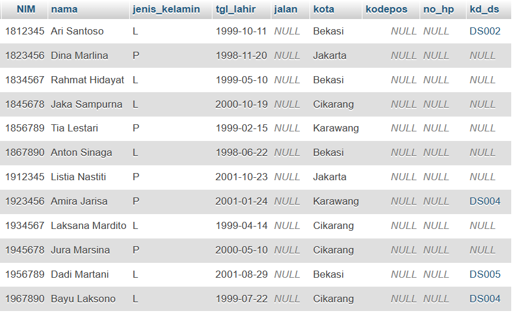
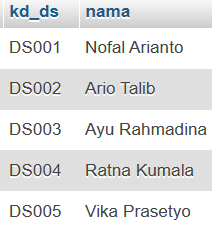
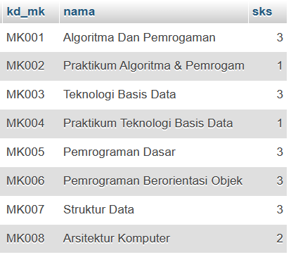
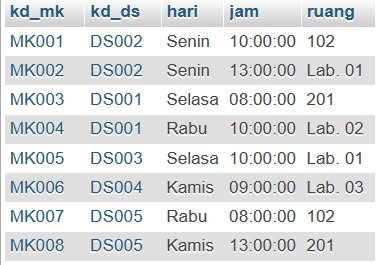
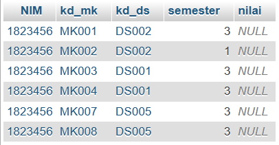

# Tugas Latihan
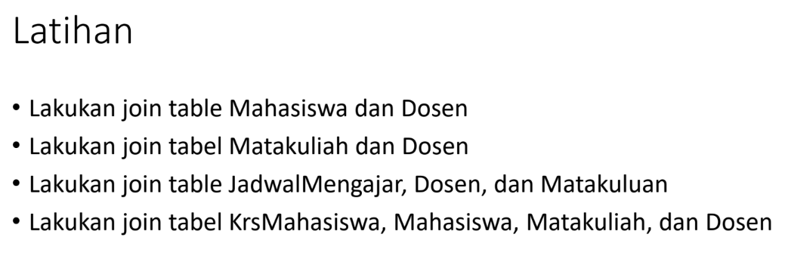

## *Note*
### Sebelum melakukan join table, terlebih dahulu saya menggunakan *Constrain* untuk menentukan aturan & membatasi jenis data yg bisa masuk ke table

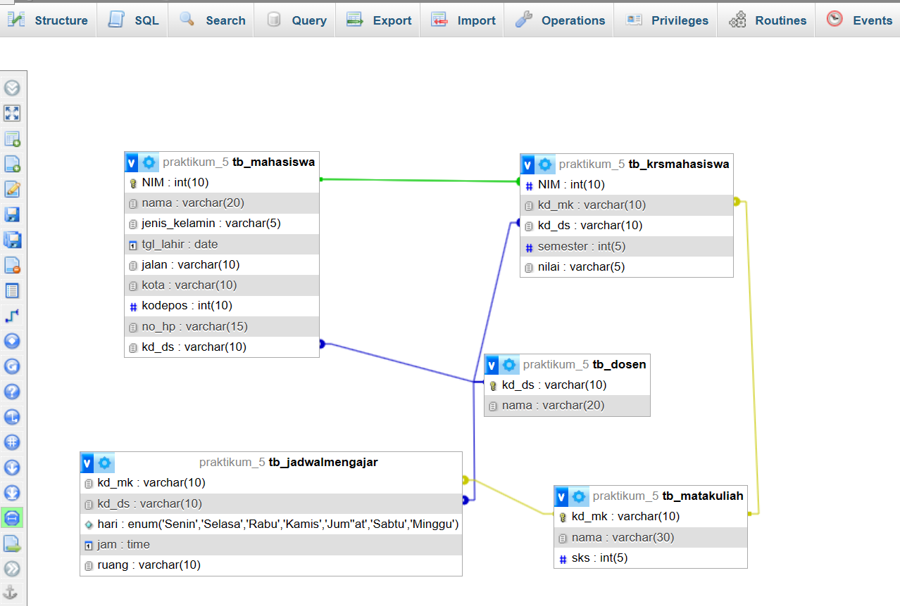


## 1 Lakukan join table Mahasiswa dan Dosen
**Query : (Menggunakan INNER JOIN)**
```sql
SELECT tb_mahasiswa.nim, tb_mahasiswa.nama, tb_mahasiswa.jk, tb_dosen.nama AS "Dosen"
FROM tb_mahasiswa INNER JOIN tb_dosen ON tb_dosen.kd_ds = tb_mahasiswa.kd_ds;
```
**Hasil :** 

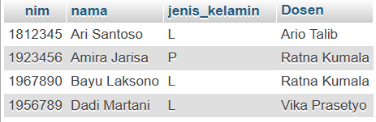

> **Note :** Digunakan untuk menampilkan baris tabel yang memiliki nilai yang sama pada kolom yang terkait.

**Query : (Menggunakan LEFT JOIN)**
```sql
SELECT tb_mahasiswa.nim, tb_mahasiswa.nama, tb_mahasiswa.jenis_kelamin, tb_dosen.nama AS "Dosen"
FROM tb_mahasiswa LEFT JOIN tb_dosen ON tb_dosen.kd_ds = tb_mahasiswa.kd_ds;
```
**Hasil :**


> **Note :** Menampilkan semua data pada table A dan sebagian data pada table B yang bersinggungan dengan table A

**Query : (Menggunakan RIGHT JOIN)**
```sql
SELECT tb_mahasiswa.nim, tb_mahasiswa.nama, tb_mahasiswa.jenis_kelamin, tb_dosen.nama AS "Dosen" 
FROM tb_mahasiswa 
RIGHT JOIN tb_dosen ON tb_dosen.kd_ds = tb_mahasiswa.kd_ds;
```
**Hasil :**


> **Note :** Menampilkan semua data pada table B dan sebagian data pada table A yang bersinggungan dengan table B

## 2 Lakukan join tabel Matakuliah dan Dosen
**Query : **
```sql
SELECT tb_matakuliah.kd_mk, tb_matakuliah.nama, tb_matakuliah.sks, tb_dosen.nama AS "Dosen Pengampu"
FROM tb_jadwalmengajar
LEFT JOIN tb_matakuliah ON tb_jadwalmengajar.kd_mk = tb_matakuliah.kd_mk
LEFT JOIN tb_dosen ON tb_jadwalmengajar.kd_ds = tb_dosen.kd_ds;
```
**Hasil :**

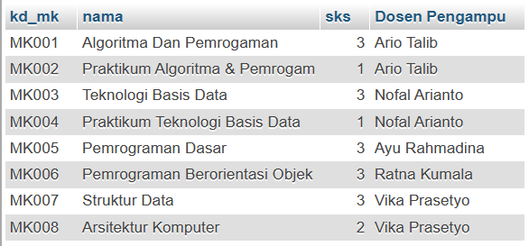

## Lakukan join table JadwalMengajar, Dosen, dan Matakuliah
**Query :**
```sql
SELECT tb_jadwalmengajar.hari, tb_jadwalmengajar.jam, tb_jadwalmengajar.ruang, tb_dosen.nama AS "Dosen Pengampu", tb_jadwalmengajar.kd_mk, tb_matakuliah.nama, tb_matakuliah.sks 
FROM tb_jadwalmengajar 
LEFT JOIN tb_matakuliah ON tb_jadwalmengajar.kd_mk = tb_matakuliah.kd_mk 
LEFT JOIN tb_dosen ON tb_jadwalmengajar.kd_ds = tb_dosen.kd_ds;
```
**Hasil :**

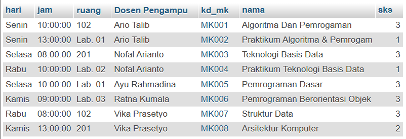

## Lakukan join tabel KrsMahasiswa, Mahasiswa, Matakuliah, dan Dosen
**Query :**
```sql
SELECT tb_mahasiswa.nim, tb_mahasiswa.nama AS "nama", tb_matakuliah.nama AS "Matakuliah", tb_matakuliah.sks, tb_dosen.nama AS "Dosen Pengampu"
FROM tb_krsmahasiswa
JOIN tb_mahasiswa ON tb_krsmahasiswa.nim = tb_mahasiswa.nim
JOIN tb_matakuliah ON tb_krsMahasiswa.kd_mk = tb_matakuliah.kd_mk
JOIN tb_dosen ON tb_krsmahasiswa.kd_ds = tb_dosen.kd_ds;
```
**Hasil :**

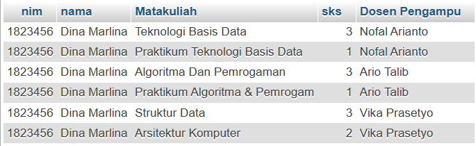

> ### Join tabel
>  join tabel merujuk pada penggabungan baris-baris data dari dua atau lebih tabel berdasarkan kolom yang memiliki nilai yang sama di setiap tabel. Join tabel memungkinkan kita untuk menggabungkan data dari tabel yang berbeda untuk menghasilkan hasil yang lebih lengkap dan terkait.

> ### Jenis2
> 1. **INNER JOIN** : Menggabungkan baris-baris data dari dua tabel berdasarkan kondisi join yang ditentukan. Hanya baris yang memiliki nilai yang cocok di kedua tabel yang akan dimasukkan ke dalam hasil join.
>
> 2. **LEFT JOIN** : Menggabungkan semua baris dari tabel kiri (left table) dengan baris yang cocok dari tabel kanan (right table) berdasarkan kondisi join. Jika tidak ada nilai yang cocok dalam tabel kanan, kolom-kolom dari tabel kanan akan memiliki nilai NULL dalam hasil join.
>
> 3. **RIGHT JOIN** : Adalah kebalikan dari LEFT JOIN. Ini menggabungkan semua baris dari tabel kanan dengan baris yang cocok dari tabel kiri berdasarkan kondisi join. Jika tidak ada nilai yang cocok dalam tabel kiri, kolom-kolom dari tabel kiri akan memiliki nilai NULL dalam hasil join.
>
> 4. **FULL JOIN** : Menggabungkan semua baris dari kedua tabel, baik dari tabel kiri maupun tabel kanan, berdasarkan kondisi join. Ini akan menghasilkan semua baris dari kedua tabel, dan jika tidak ada nilai yang cocok dalam salah satu tabel, kolom-kolom yang tidak cocok akan memiliki nilai NULL dalam hasil join.
